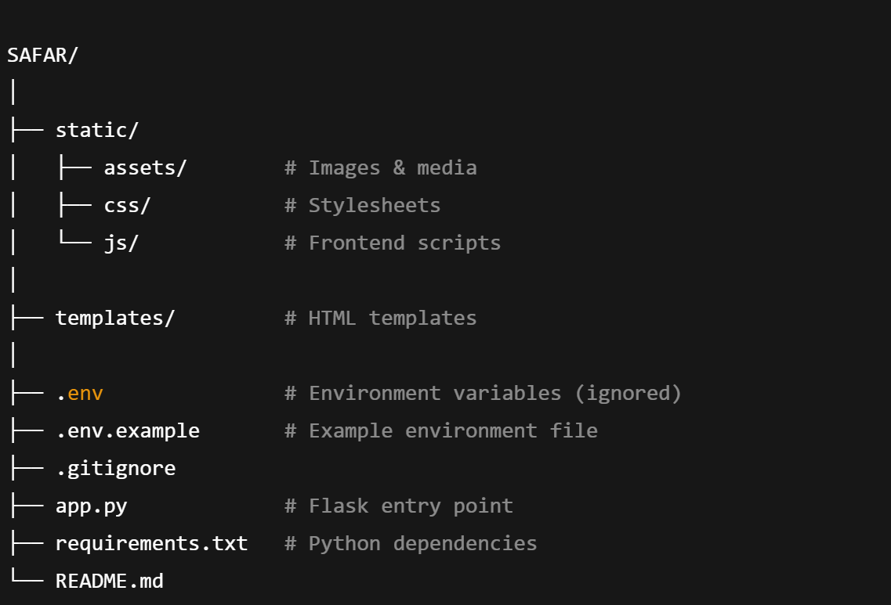

<!-- # Safar – AI Travel Assistant

Safar is a beginner-friendly AI-powered travel assistant designed to help users
plan trips by answering questions related to destinations, budget, best time to visit,
stay options, and travel safety.

## Features
- Clean landing page
- Chat-based AI assistant UI
- User & assistant message bubbles
- Responsive design
- Flask-based backend

## Tech Stack
- HTML, CSS, JavaScript
- Python (Flask)
- GitHub for collaboration

## How to Run Locally
```bash
pip install -r requirement.txt
python app.py -->


🌍 <b>SAFAR- AI TRAVEL ASSISTANT<b>

Safar is an AI-powered travel assistant that helps users plan trips by answering questions related to destinations, budget, best time to visit, accommodation options, and travel safety.

This project is built with a Flask backend, Supabase (PostgreSQL) database, and a clean frontend, following industry-style project organization and contribution practices.

<b>FEATURES:<b>

1.Clean landing page
<br>
2.Chat-based AI assistant UI
<br>
3.User & assistant message bubbles
<br>
4.Multiple informational pages (About, Features, FAQ)
<br>
5.Responsive design
<br>
6.Flask-based backend
<br>
7.Supabase (PostgreSQL) database integration
<br>
8.Environment-variable based configuration
<br>

Tech Stack <br>
Frontend: <br>
HTML<br>
CSS<br>
JavaScript<br>

Backend:<br>
Python<br>
Flask<br>

Database:<br>
Supabase (PostgreSQL)<br>

Tools: <br>
Git & GitHub <br>
Virtual Environment (venv) <br>


<b>FOLDER STRUCTURE<b>




<b>Prerequisites:<b>

Python 3.8+ <br>
pip <br>
Git  <br>

<b>Check installation:<b>

python --version  <br>
pip --version     <br>
git --version     <br>

<b>Running the Project Locally:<b>

1️⃣ Clone the Repository- <br>
git clone https://github.com/your-username/SAFAR.git
<br>
cd SAFAR <br>

2️⃣ Create & Activate Virtual Environment (Recommended): <br>

Windows<br>
python -m venv venv<br>
venv\Scripts\activate<br>

3️⃣ Install Dependencies:
<br>
pip install -r requirements.txt <br>


4️⃣ Environment Setup <br>

Create .env from the example:
<br>
cp .env.example .env


5️⃣ Run the Application:
<br>
python app.py <br>

Open:
http://127.0.0.1:5000/


🎉 Application is live locally.


.

🤝 How to Contribute: <br>

We welcome contributions from beginners and experienced developers alike


Step 1: <br>
Fork the Repository<br>
Go to the GitHub repository<br>
Click Fork (top-right)<br>

This creates a copy under your account<br>

Step 2: Clone Your Fork<br>
git clone https://github.com/your-username/SAFAR.git <br>
cd SAFAR<br>


Step 3: Create a Branch
<br>
git checkout -b feature/your-feature-name<br>


Examples:
<br>
git checkout -b fix-chat-ui <br>
git checkout -b improve-backend-logic


Step 4: Make Changes <br>

Follow existing structure <br>
Write clean, readable code <br>
Test locally before committing <br>


Step 5: Commit Changes  <br>
git add . <br>
git commit -m "Short, meaningful commit message" <br>


Step 6: Push to Your Fork <br> 

git push origin feature/your-feature-name<br>


🧠 Contribution Guidelines <br>

Keep commits small <br>
Don’t commit .env files<br>
Follow project structure<br>
Write clear commit messages<br>
Be respectful and constructive<br>

